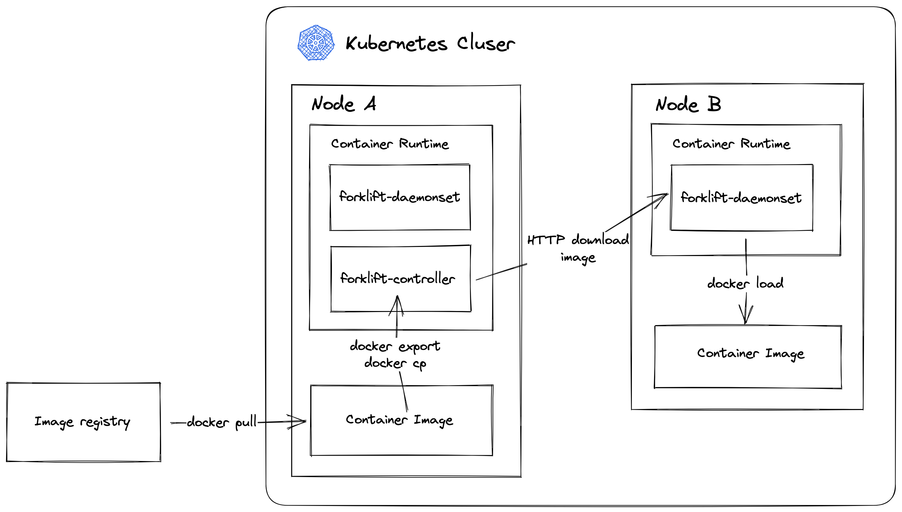

# 🚜 forklift  [](https://goreportcard.com/report/github.com/wuhan005/forklift) [](https://sourcegraph.com/github.com/wuhan005/forklift) [](https://artifacthub.io/packages/search?repo=forklift)

Lightweight container image pre-download component for Kubernetes.

## Installation

### Install with Helm

```bash
helm repo add forklift https://wuhan005.github.io/forklift/charts
helm install forklift forklift/forklift
```

* `Values.yaml`

```yaml
replicaCount: 1

namespace: default

image:
  controller: wuhan005/forklift:controller
  daemon: wuhan005/forklift:daemon
imagePullPolicy: IfNotPresent
service:
  type: NodePort
  port: 80
  targetPort: 80

controller:
  activeNamespace: # The image in these namespaces will be pre-downloaded.
    - default
```

## How it works?



## License

MIT License
